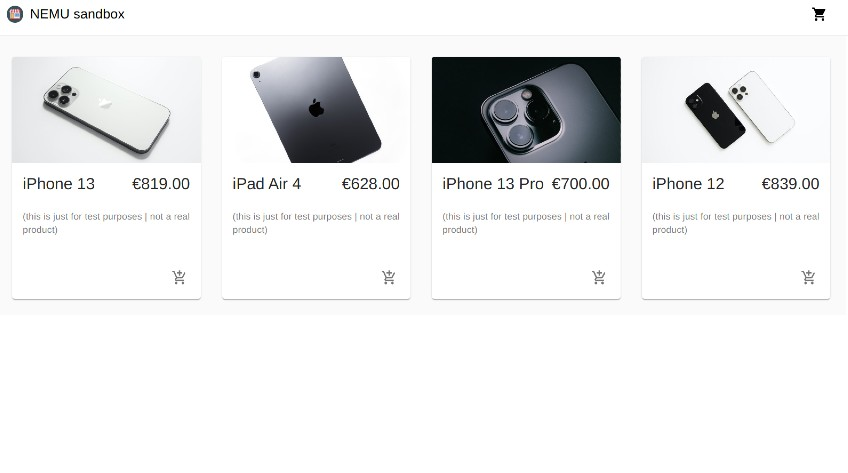

<!-- # 🍯
API
app prgramming interface
 

#### [NOTES : interesting](./src/Interesting.md)

 

# CREDITS:

Big thanks to **[Adrian Hajdin](https://github.com/adrianhajdin)** , for sharing this **Great tutorial** on how to set up an E-commerce store using: React | Commerce.js and Stripe.

>**NOTE** THE TEACHER tells that if we are using PROPS too much, the solution for it, is React Context

- But he is not going to use it in this project because we dont have many functions.

- I will create a recap react context soon (based in my school lessons)

- 1. default-project
- 2. navbar-basic-and-default-commercejs-setup
- 3. fecthing-data-from-commercejs
- 4. creating-products-with-commercejs-adding-dynamic-button-add-to-basket
- 5. Cart.CartItem-buttons-increase-decrease-remove
- 6. buttons-increase-decrease-remove-emptyCart-allready
- 7. checkoutTokenId-part1
- 8. token-shipping-Countries
- 9. token-shipping-Subdivisions
- 10. token-shipping-Options
- 11. the-next-button-before-payment-form
- 12. stripe-1
- 13. stripe-2-order-confirmation-done
- 14. confirmation-styling-and-spinner-end/README.md

https://commercejs.com/blog/adding-assets-via-the-chec-api/

-----------------------------------------
All deprecated elements:

https://commercejs.com/docs/api/#versioning

*-----------------------------------------

Oladimeji Odunsi_beauty-woman1.jpeg
Aiony Haust_beauty-woman2.jpeg
pexels-linda-prebreza-286951.jpg
pexels-valeriia-miller-3910071.jpg
pexpexels-Venus-HD-Make-up-and-Perfume-2587363.jpg

-->

 

# _NEMU_ e-boutique

 

### About

 

> **I started this project out of curiosity**, I wanted to see the **advantages & disadvantages** in building an e-commerce app using React, **Commercejs and stripe** and an app build with (Mongodb, Express, React and Nodejs | **MERN**).     **PROS:** Its certainly faster to build, in more of that **commercejs** has some nice tools to communicate with the client. **CONS:** as a beginner I like to have the code in front of me to see from where an issue is coming, **commercejs** doesn't offer that.

 

## THE MOTIVATION

 

> **The main motivator for this project was my curiosity** as well as my desire to expand my knowledge. Due to the disastrous effect **the pandemic had on the small businesses** I used to visit, I decided I wanted to find a way to create websites and e-commerce stores that any business owner could use to represent their wares online, be it small or big.  
> Although it isn't fully functional yet, as there is a final error I have to correct to publish it on the web, this is the result of my work.
> **Aside from that I wasn't entirely satisfied with the design so I customized it** as you can see from the preview shown below.

 

## THE CUSTOM VERSION

 

- After I finished the default version, I decided to customized it a bit (its still **in process**).

 

##### (Preview)

 

 
 

## INDEX

 

1. [default-project](https://github.com/nadiamariduena/e-commerce-react-stripe/tree/default-project)
2. [navbar-basic-and-default-commercejs-setup](https://github.com/nadiamariduena/e-commerce-react-stripe/tree/navbar-basic-and-default-commercejs-setup)
3. [fecthing-data-from-commercejs ](https://github.com/nadiamariduena/e-commerce-react-stripe/tree/fecthing-data-from-commercejs)
4. [creating-products-with-commercejs-adding-dynamic-button-add-to-basket](https://github.com/nadiamariduena/e-commerce-react-stripe/tree/creating-products-with-commercejs-adding-dynamic-button-add-to-basket)
5. [Cart.CartItem-buttons-increase-decrease-remove](https://github.com/nadiamariduena/e-commerce-react-stripe/tree/Cart.CartItem-buttons-increase-decrease-remove)
6. [buttons-increase-decrease-remove-emptyCart-allready](https://github.com/nadiamariduena/e-commerce-react-stripe/tree/buttons-increase-decrease-remove-emptyCart-allready)
7. [checkoutTokenId-part1](https://github.com/nadiamariduena/e-commerce-react-stripe/tree/checkoutTokenId-part1)
8. [token-shipping-Countries](https://github.com/nadiamariduena/e-commerce-react-stripe/tree/token-shipping-Countries)
9. [token-shipping-Subdivisions](https://github.com/nadiamariduena/e-commerce-react-stripe/tree/token-shipping-Subdivisions)
10. [token-shipping-Options](https://github.com/nadiamariduena/e-commerce-react-stripe/tree/token-shipping-Options)
11. [the-next-button-before-payment-form](https://github.com/nadiamariduena/e-commerce-react-stripe/tree/the-next-button-before-payment-form)
12. [stripe-1](https://github.com/nadiamariduena/e-commerce-react-stripe/tree/stripe-1)
13. [stripe-2-order-confirmation-done ](https://github.com/nadiamariduena/e-commerce-react-stripe/tree/stripe-2-order-confirmation-done)
14. [confirmation-styling-and-spinner-end](https://github.com/nadiamariduena/e-commerce-react-stripe/tree/confirmation-styling-and-spinner-end)

 

 

## 📓 NOTES:

<!-- ##### You will not find the .env file with the respective credentials (related to commercejs and stripe) to this repository

- Read more inside the [security](./src/security.md) -->

 

#### [Instructions](./src/Instructions.md)

#### [Commun errors](./src/errors.md)

#### [Only stripe](./src/onlyStripe.md)

#### [Security](./src/security.md)

#### [Interesting](./src/Interesting.md)

#### [unrelated](./src/unrelated.md)

#### [All deprecated elements:](https://commercejs.com/docs/api/#versioning)

 

 

### DEBUGGING:

- Interesting links that helped me to debug the last warnings of the project

- Read more inside the [debugging](./src/debugging.md)

 

[Cleanup memory leaks on an Unmounted Component in React Hooks](https://stackoverflow.com/questions/59780268/cleanup-memory-leaks-on-an-unmounted-component-in-react-hooks)

[Can different cleanups be done conditionally in useEffect?](https://stackoverflow.com/questions/59890480/can-different-cleanups-be-done-conditionally-in-useeffect)

 

 

# CREDITS > TEACHER:

Big thanks to **[Adrian Hajdin](https://github.com/adrianhajdin)** , for sharing this **Great tutorial** on how to set up an E-commerce store using: **React | Material UI | Commerce.js and Stripe**.

##### [Official project repository](https://github.com/adrianhajdin/project_e_commerce)

 

##### [YOUTUBE | ECommerce Web Shop - Build & Deploy an Amazing App | React.js, Commerce.js, Stripe](https://www.youtube.com/watch?v=377AQ0y6LPA&t=10739s)

 

 

### CREDITS IMAGES

- [Oladimeji Oduns](https://unsplash.com/@oladimeg)
- [ Aiony Haust](https://unsplash.com/@aiony)
- [Linda Prebreza](https://www.pexels.com/fr-fr/@linda-prebreza-87411)
- [ Valeriia Miller](https://unsplash.com/@iyamiphotography)

 

#### Videos

 

- [Cottonbro](https://www.pexels.com/fr-fr/@cottonbro/collections/)
- [Mikhail Nilov](https://www.pexels.com/fr-fr/collections/bastille-day-iqetquk/)
